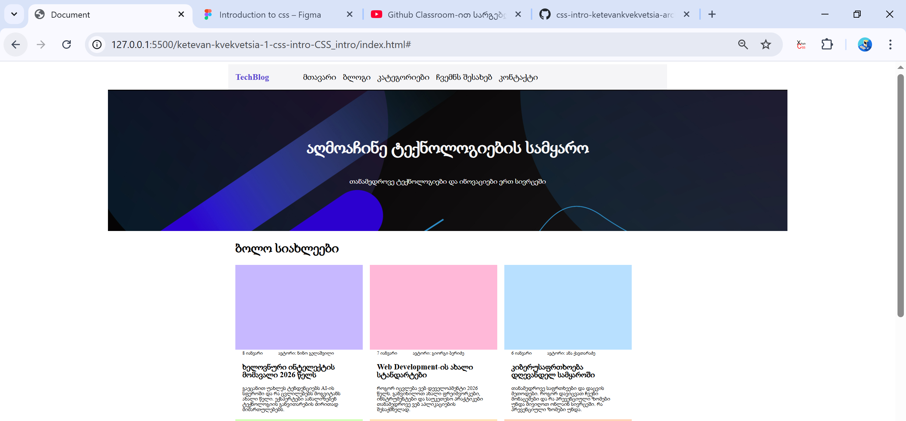
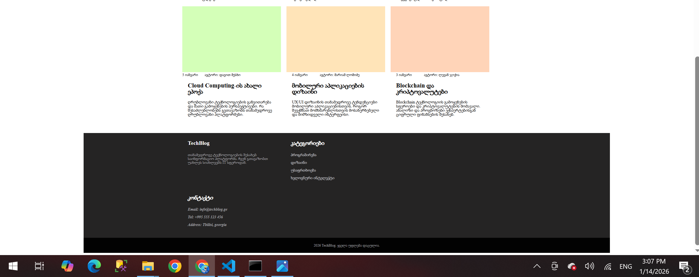

# TechBlog

TechBlog არის სტატიკური ვებგვერდი, რომელიც შექმნილია HTML და CSS-ის გამოყენებით.  
პროექტი წარმოადგენს ტექნოლოგიურ ბლოგს, სადაც განთავსებულია უახლესი სტატიები IT სფეროდან.

---

## 📌 ფუნქციონალი

- Header ნავიგაციით
- Hero სექცია სათაურითა და აღწერით
- სტატიების სექცია (article თეგების გამოყენებით)
- Footer საკონტაქტო ინფორმაციით
- სემანტიკური HTML თეგების გამოყენება (`header`, `section`, `article`, `footer`, `address`, `time`)

---

## 🛠 გამოყენებული ტექნოლოგიები

- HTML5
- CSS3
- Semantic HTML

---

## 📂 პროექტის სტრუქტურა
├── index.html
├── style.css
├── img/
│ ├─ 22.jpg
│ │── preview.png
│ │── preview1.png
│ │── preview2.png
└── README.md

